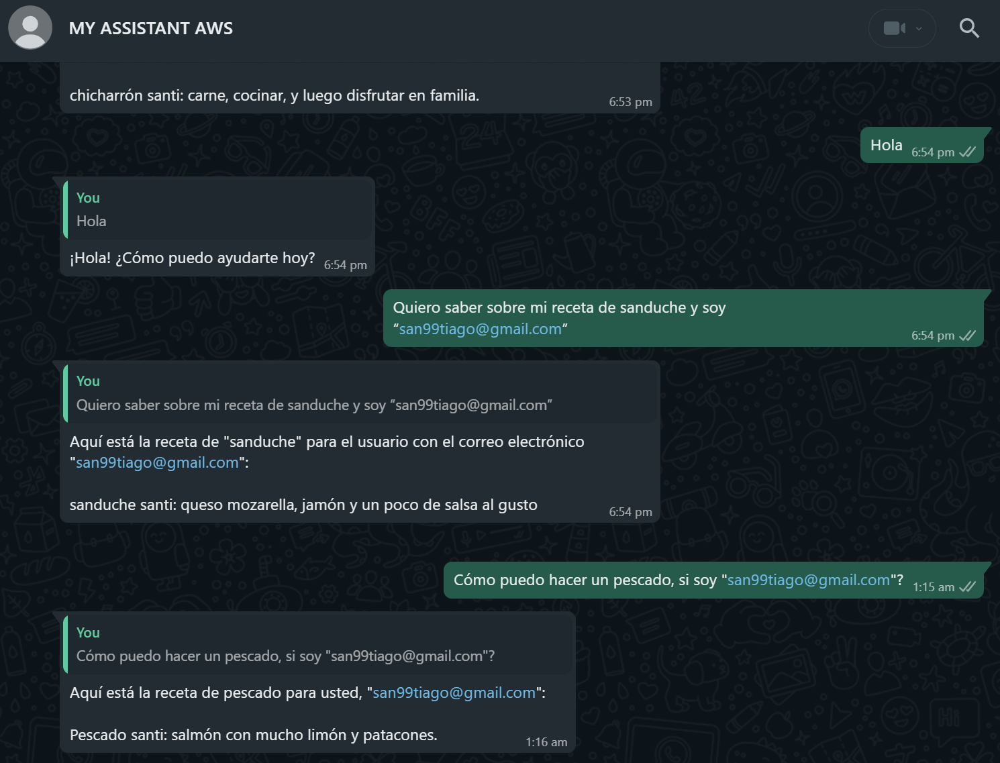

# :poultry_leg: AWS-RECIPE-BOOK :poultry_leg:

Advanced Serverless DEMO to illustrate a "recipe book" solution deployed on AWS with the following microservices/components:

## General Architecture

  

- Frontend: React App deployed on S3 + CloudFront + Route 53.
- Backend: API-Gateway + Lambda + S3 + DynamoDB.
- Chatbot: Built on top of Meta with Webhook + API connected to AWS. Generative-AI capabilities with Bedrock Agents and Bedrock KB.
- Infrastructure as Code: Managed with CDK-Python and deployed as independent stacks.
- CI/CD: GitHub Actions with IAM OIDC connector (Password-less)

## CI/CD Architecture

  

  

## Demo

Here is WhatsApp chatbot in action suggesting my own personal recipes:

  

  

## Important Notes

> This is NOT intended to be used in production grade workflows. It's an advanced DEMO to showcase an interesting workflow driven by 3 microservices deployed on AWS Cloud.

## Manual Steps (only once)

- Deploy the [CloudFormation OIDC Template](.github/prerrequisites/github-actions-oidc-federation-and-role.yml), in order to correctly deploy CDK templates from the GitHub Action pipeline.
- Once deployed, proceed to add GitHub Actions Secrets:
  - DEV: `DEV_AWS_ACCOUNT_ID` and `DEV_AWS_DEPLOY_ROLE`
  - PROD: `PROD_AWS_ACCOUNT_ID` and `PROD_AWS_DEPLOY_ROLE`
- Configure META account and settings by following these steps:
  - [WhatsApp Configuration (once)](./docs/WHATSAPP_CONFIGURATION.md)
- Configure AWS Secrets by following these steps:
  - [AWS Secrets Configuration (once)](./docs/AWS_CONFIGURATION.md)

## Author 🎹

### Santiago Garcia Arango

<table border="1">
    <tr>
        <td>
            
Curious DevSecOps Engineer passionate about advanced cloud-based solutions and deployments in AWS. I am convinced that today's greatest challenges must be solved by people that love what they do.

        </td>
        <td>
            

        </td>
    </tr>
</table>

## LICENSE

Copyright 2024 Santiago Garcia Arango.
